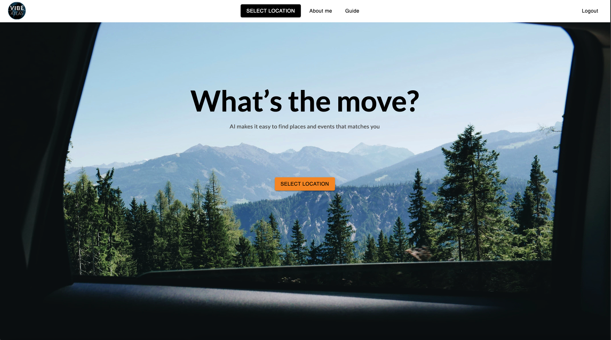
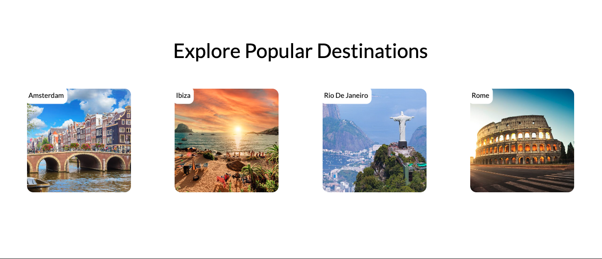

# VibeAtlas

## Table of Contents

- [About The Project](#about-the-project)
- [Core Features](#core-features)
- [Screenshot](#screenshot)
- [Built With / Tech Stack](#built-with--tech-stack)
- [Prerequisites / Dependencies](#prerequisites--dependencies)
- [How to Run](#how-to-run)
- [License](#license)
- [Contact](#contact)

---

## About The Project

Traveling? Looking for something fun to do?  
Get AI-powered personalised suggestions for places to visit: from buzzing city nights to hidden paradise escapes, VibeAtlas serves up instant recommendations that match your energy.

It’s free, effortless, and actually understands your style. Whether you’re feeling city lights, beach waves, or something off the grid, we’ve got you.

**VibeAtlas** is a smart travel companion that uses user-selected preferences and AI to generate curated destination suggestions — built for people who want to vibe, not search.

---

## Core Features

- Multi-step, card-based onboarding survey for personalization
- AI-powered destination recommendation engine
- Google login and secure Firebase authentication
- Modern, clean frontend using React, MUI, and React Bits
- RESTful API backend built with Express.js
- Data stored in a MySQL database
- Uses multiple external APIs for location and event data
- Environment-configurable via `.env` file

---

## Screenshot

### Home page



## Built With / Tech Stack

**Frontend:**

- React
- Material UI (MUI)
- React Bits

**Backend:**

- Express.js (Node.js)
- Firebase Authentication (Email & Google login)
- MySQL (Relational Database)

**APIs Used:**

- Gemini API
- Ticketmaster API
- RapidAPI integrations
- GeoNames API
- OpenCage Geocoding API

---

## Prerequisites / Dependencies

- Node.js (v18 or higher recommended)
- npm or yarn
- MySQL server running locally or remotely
- Firebase project with enabled auth providers (email & Google)
- API keys for all external services listed in `.env`

---

## How to Run
```bash
1. Clone the repository

git clone https://github.com/your-username/vibeatlas.git
cd vibeatlas


2. Install dependencies 
# Frontend
cd client
npm install

# Backend
cd ../server
npm install

3. Set up environment variables
# From project root
cp server/.env.example server/.env
#Then open server/.env and fill in your API credentials.
```

## License

This project is open-source. License details coming soon.

## Contact
- Email: ghazali.raydan@gmail.com
- GitHub: github.com/iamrayghazali